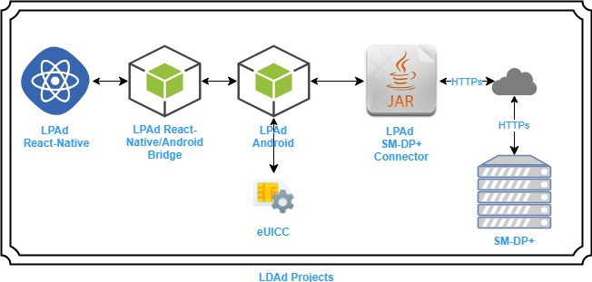
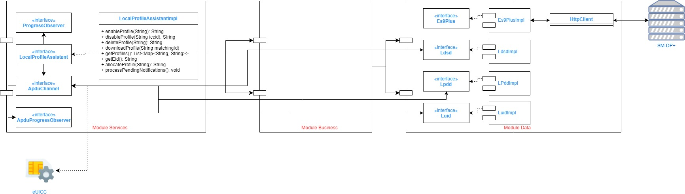

<h1>Local Profile Assistant for Device (LPAd) - LPAd SM-DP+ Connector</h1>

This project offers an implementation of the
[SGP22](https://www.gsma.com/newsroom/wp-content/uploads//SGP.22_v2.2.pdf) Local
Profile Assistant for Device (*LPAd*).

Allows communication with the *SM-DP+* and implements the needed logic of *ES9+
(LPA -- SMDP+) interface*. It is also implemented all the logic for *ES10x (LPA
-- eUICC)* interface. It is implemented in *Java*.

</br>
<h2>LPAd Truphone Projects</h2>

The current project is only one part of several other *Truphone*’s\* *projects
that implement* LPAd *totally. The following diagram gives an overview of
currently existing projects that relate to* Truphone*’s* LPAd \*implementation:



High level explanation of the several *Truphone*’s *LPAd* projects:

-   **LPAd React-Native** - *UI* for List Profiles, Download a Profile and
    Enable/Disable/Delete a Profile. It is implemented in *React-Native*.

-   **LPAd React-Native/Android Bridge** - Allows *React-Native* sub-project
    code to communicate with *LPAd Android* sub-project code. This
    implementation is specific for *React-Native* and *Android*/*Java*.

-   **LPAd Android** - Allows communication (through *Android TelephonyManager*)
    with the installed *eUICC* on the *Device*. It is also the *Proxy* to *LPAd
    RSP Connector* sub-project. Implemented in Android/*Java*

-   **LPAd SM-DP+ Connector** - This project. Allows communication with the
    *SM-DP+* and implements the needed logic of *ES9+ (LPA -- SMDP+) interface*.
    It is also implemented all the logic for *ES10x (LPA -- eUICC)* interface.
    It is implemented in *Java*.

</br> 
<h2>LPAd SM-DP+ Connector High Level Architecture</h2>

The following diagram depicts the project high level architecture:



 
</br>
<h2>Usage</h2>
 
Maven coordinates to import this lib into your project:
* Gradle
```gradle
com.truphone.lpad:lpad-sm-dp-plus-connector:1.0.4
```
* Maven
```maven
<dependency>
  <groupId>com.truphone.lpad</groupId>
  <artifactId>lpad-sm-dp-plus-connector</artifactId>
  <version>1.0.4</version>
</dependency>

```

To start using this lib in your code, you'll only need to write the following lines:
* Get EID
```java
// Your ApduChannelImpl implementation
ApduChannelImpl apduChannel = new ApduChannelImpl(getApplicationContext());
LocalProfileAssistantImpl localProfileAssistant = new LocalProfileAssistantImpl(apduChannel, "<your-rsp-server-url>");
String eid = localProfileAssistant.getEID();
```
* Allocate Profile
```java
// Your ApduChannelImpl implementation
ApduChannelImpl apduChannel = new ApduChannelImpl(getApplicationContext());
LocalProfileAssistantImpl localProfileAssistant = new LocalProfileAssistantImpl(apduChannel, "<your-rsp-server-url>");
String acToken = localProfileAssistant.allocateProfile("268");
```
</br>
</br>

<h1>APDU Channel Simulator</h1>

This component implements the APDU Channel interface which can be used to create E2E tests dynamically without depending on a specific APDU Channel implementation.

</br>
<h2> Usage</h2>

Maven coordinates to import this lib into your project:
* Gradle
```gradle
com.truphone.lpad:apdu-channel-simulator:1.0.4
```
* Maven
```maven
<dependency>
  <groupId>com.truphone.lpad</groupId>
  <artifactId>apdu-channel-simulator</artifactId>
  <version>1.0.4</version>
</dependency>
```

The modo-operandis is first of all define the expectation result for the operation you want to invoke, and then perform the invocation.

Examples:
* TransmitAPDU
```java

// initialization
LpadApduChannelSimulator lpadApduChannelSimulator = new LpadApduChannelSimulator(new MapPersistence(new HashMap()));

// first you need to define the expectation
lpadApduChannelSimulator.setTransmitAPDUExpectation("APDU_SUCCESS", "asdsdasd23123easd");

// then invoke the 'TransmitAPDU' operation which will return the value defined on the expectation
assertEquals("asdsdasd23123easd", lpadApduChannelSimulator.transmitAPDU("APDU_SUCCESS"));

```